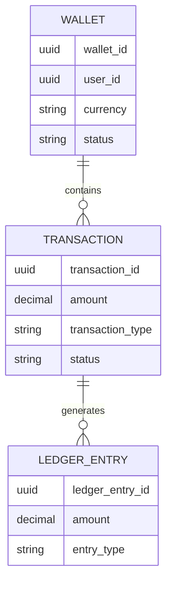

# Database Relationships

---

# Overview

The persistence layer prioritizes:

* auditability
* immutable financial history
* transactional integrity
* reconciliation support

---

# Wallet Entity

Wallets represent:

* account ownership
* wallet state
* balance coordination

---

# Transaction Entity

Transactions represent immutable financial operations.

Examples:

* funding
* debits
* transfers
* reversals

---

# Ledger Entries

Ledger entries provide:

* accounting traceability
* replay capability
* reconciliation support
