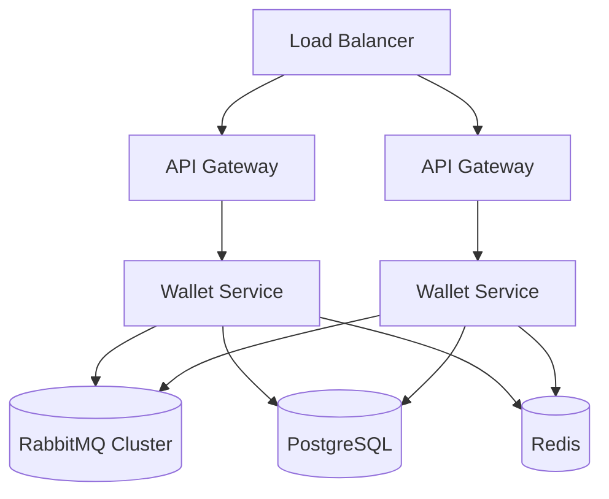

# Deployment Topology

---

# Overview

The deployment architecture supports horizontally scalable service deployment patterns.

The platform prioritizes:

* independent scaling
* stateless services
* infrastructure resilience
* workload distribution

---

# Scalability Principles

Services remain stateless wherever possible to improve:

* deployment flexibility
* scaling efficiency
* failure recovery

---

# Infrastructure Coordination

Infrastructure components provide:

* messaging coordination
* persistence
* caching
* distributed synchronization
