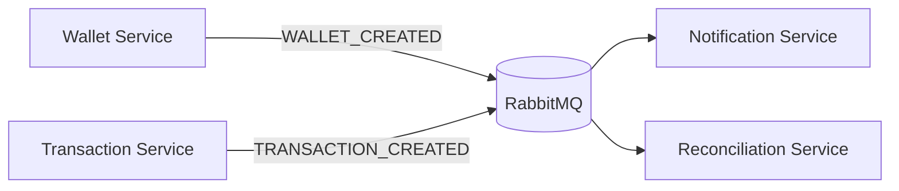

# Event-Driven Workflow

---

# Overview

The platform uses asynchronous domain events for service communication.

This architecture reduces:

* synchronous coupling
* cascading failures
* service interdependencies

while improving:

* scalability
* resilience
* workload isolation

---

# Event Philosophy

Events represent:

* completed domain actions
* immutable workflow milestones
* asynchronous communication triggers

Examples:

* WALLET_CREATED
* TRANSACTION_CREATED
* WALLET_FUNDED
* TRANSACTION_FAILED

---

# Benefits

The event-driven architecture improves:

* service independence
* scalability
* replay safety
* retry handling
* operational flexibility

---

# Tradeoffs

The architecture intentionally accepts:

* eventual consistency
* asynchronous complexity
* operational coordination overhead

in exchange for:

* scalability
* resilience
* fault isolation
