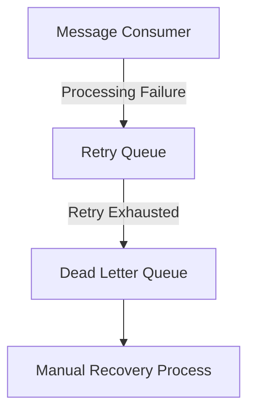

# Failure Handling Flow

---

# Overview

The platform assumes failures are inevitable within distributed systems.

The architecture therefore includes:

* retry workflows
* dead-letter queues
* replay-safe recovery
* operational correction mechanisms

---

# Retry Philosophy

Transient failures are treated as normal operational behavior.

Retries improve:

* resilience
* recovery capability
* asynchronous stability

---

# Dead Letter Queues

Dead-letter queues isolate:

* poison messages
* unrecoverable workflows
* repeated processing failures

This improves:

* operational visibility
* debugging
* controlled recovery

---

# Recovery Workflows

Recovery processes may include:

* replay operations
* manual correction
* event reprocessing
* reconciliation-driven recovery
