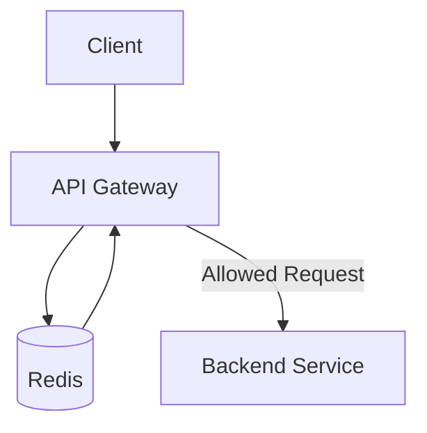

# Rate Limiting Flow

---

# Overview

Distributed rate limiting protects backend services from:

* abuse
* denial-of-service scenarios
* accidental overload
* infrastructure exhaustion

---

# Redis Coordination

Redis enables:

* distributed counters
* horizontally scalable enforcement
* shared throttling state

---

# Gateway Enforcement

The API Gateway handles:

* request validation
* throttling enforcement
* retry guidance
* abuse protection

---

# Architectural Goals

The rate limiting architecture prioritizes:

* operational stability
* infrastructure protection
* scalable enforcement
