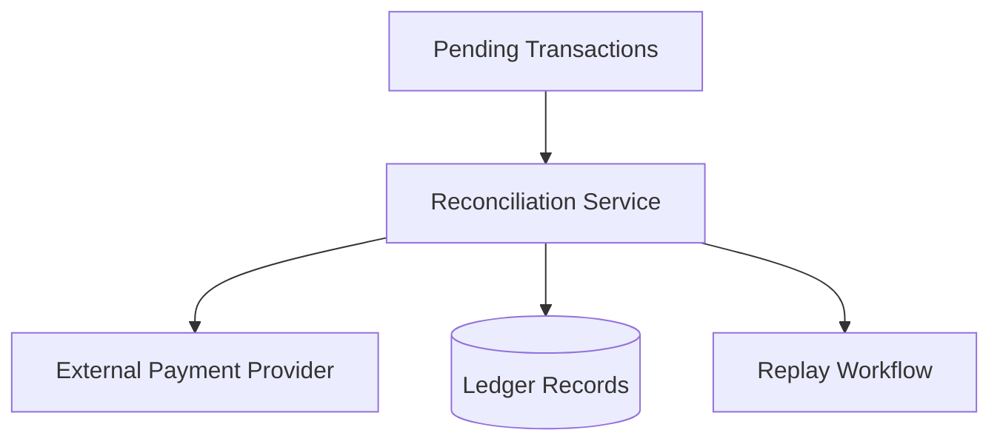

# Reconciliation Flow

---

# Overview

The reconciliation workflow validates eventual consistency across distributed financial workflows.

The architecture assumes:

* delayed callbacks occur
* transient failures exist
* distributed systems experience inconsistencies

---

# Reconciliation Responsibilities

The Reconciliation Service validates:

* transaction states
* provider settlements
* ledger integrity
* wallet consistency

---

# Replay Workflows

Replay-safe processing enables:

* failure recovery
* eventual consistency restoration
* operational correction

Idempotency guarantees replay safety.

---

# Financial Correctness

Reconciliation is considered a core financial systems responsibility rather than an optional operational feature.

The platform prioritizes:

* auditability
* recoverability
* consistency validation
