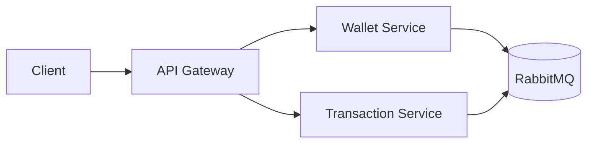

# Service Communication

---

# Overview

The architecture minimizes direct synchronous service-to-service dependencies.

RabbitMQ acts as the asynchronous coordination backbone.

---

# Communication Principles

The platform prioritizes:

* loose coupling
* asynchronous communication
* independent service evolution
* fault isolation

---

# Gateway Responsibilities

The API Gateway centralizes:

* authentication
* authorization
* request validation
* request tracing

---

# Messaging Responsibilities

RabbitMQ enables:

* asynchronous workflows
* retries
* event-driven coordination
* workload buffering
