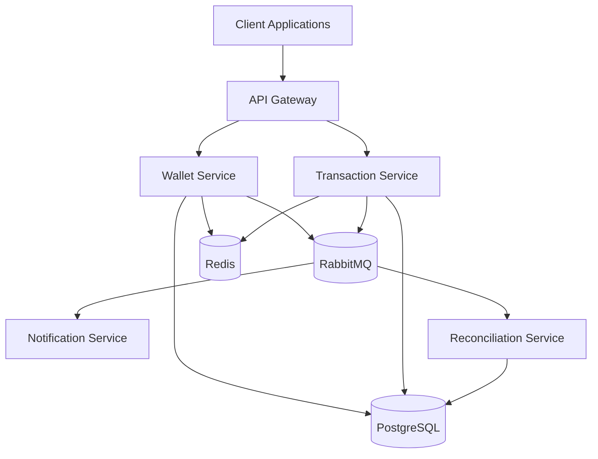

# System Architecture

---

# Overview

The Wallet-as-a-Service platform uses a distributed event-driven architecture centered around asynchronous communication through RabbitMQ.

The architecture prioritizes:

* fault isolation
* scalability
* replay-safe workflows
* operational resilience
* asynchronous coordination

---

# Architectural Layers

## Client Layer

External clients communicate through the API Gateway.

Examples:

* mobile applications
* web dashboards
* external services
* internal platforms

---

## Gateway Layer

The API Gateway handles:

* authentication
* authorization
* request validation
* rate limiting
* request tracing

---

## Service Layer

Core business logic remains isolated within dedicated services.

Examples:

* wallet management
* transaction orchestration
* notification handling
* reconciliation processing

---

## Messaging Layer

RabbitMQ enables:

* asynchronous communication
* workload buffering
* retry workflows
* event-driven scalability

---

## Persistence Layer

PostgreSQL acts as the authoritative system of record.

Redis supports:

* caching
* distributed coordination
* rate limiting
* temporary state management

---

# Distributed Systems Characteristics

The architecture intentionally embraces:

* eventual consistency
* asynchronous workflows
* replay-safe event processing
* retry-driven resilience

The system assumes:

* failures are inevitable
* duplicate events may occur
* reconciliation is necessary
