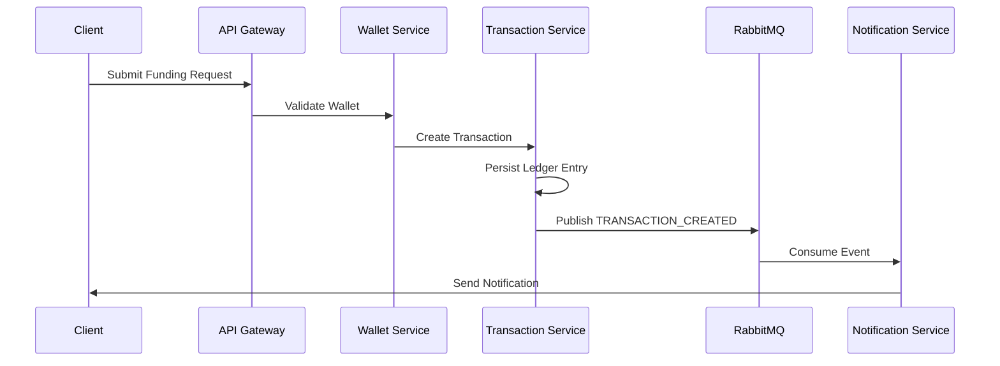

# Wallet Funding Flow

---

# Overview

This diagram demonstrates the asynchronous wallet funding workflow.

The process prioritizes:

* transaction traceability
* replay safety
* event-driven coordination
* operational resilience

---

# Workflow Steps

## Step 1 — Funding Request

The client submits a wallet funding request through the API Gateway.

---

## Step 2 — Validation

The Wallet Service validates:

* wallet existence
* wallet status
* funding rules

---

## Step 3 — Transaction Creation

The Transaction Service:

* creates transaction records
* generates ledger entries
* persists immutable financial history

---

## Step 4 — Event Publication

The transaction workflow publishes domain events through RabbitMQ.

This allows:

* asynchronous processing
* service decoupling
* workload buffering

---

## Step 5 — Notification Processing

Notification workflows operate independently from core transaction execution.

This prevents non-critical failures from blocking financial operations.

---

# Architectural Goals

The workflow demonstrates:

* event-driven architecture
* fault isolation
* asynchronous communication
* financial auditability
